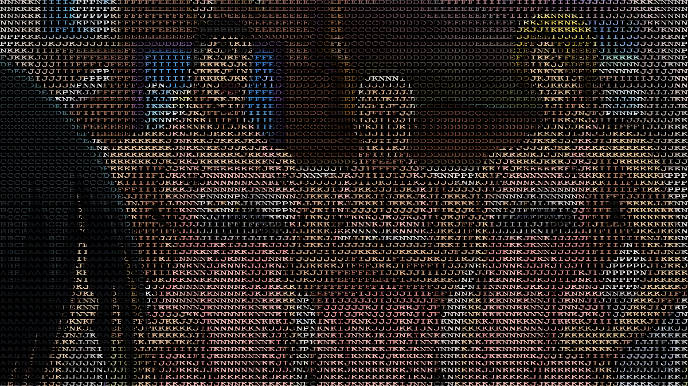
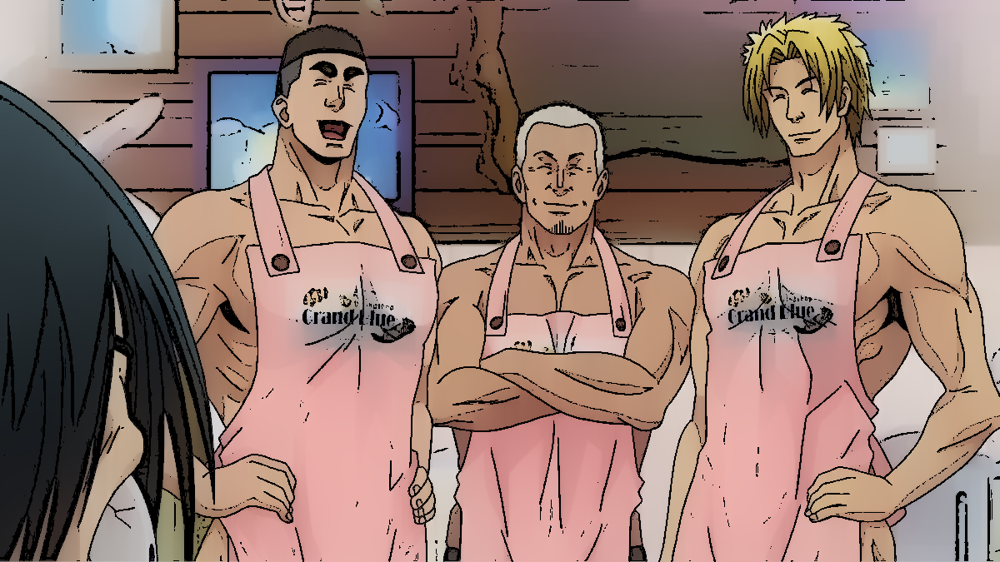
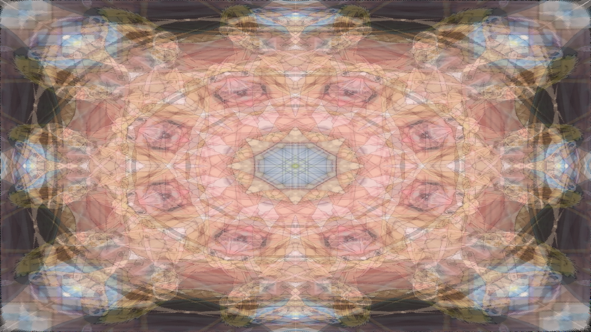

# OpenCV-Special-Effects
Modules that generate images with a variety of effects such as: ASCII art, Manga style, Cartoon, Retro, and Kaleidoscope as well as a few others

Modules include:

ascii_art.py for generating colorized ASCII art images  
inkstyle.py for generating pen, manga, and cartoonized effects  
kaleidoscope.py for generating kaleidoscope images  
retrofy.py for generating images that have a retro 90s look (works better for animated images)
                 
Prior to use some modules require the installation of ImageMagick and Wand. You can follow the instructions given at https://docs.wand-py.org/en/0.4.1/guide/install.html for your specific OS to achieve this.

A big thank you KobeJohn on Stackoverflow for supplying an elegant solution for converting a .txt file to a Pillow image (https://stackoverflow.com/questions/29760402/converting-a-txt-file-to-an-image-in-python). Also much appreciation to (https://pypi.org/project/squircle/) as the kaleidoscope module employs some modified and optimized functions from your package.

All in all may this collection of effects find some usefullness. Thank you for your patronage DanKulik

| **ASCII Art**   call ascii_art.draw.mk_ascii() |
|:--:|
||
 
| **Manga**   call inkstyle.draw.manga() |
|:--:|

| **Cartoonize**   call inkstyle.draw.cartoonize() |
|:--:|

| **Kaleidoscope**   call kaleidoscope.draw.kaleidoscope() |
|:--:|

| **Retro**   call retrofy.draw.std_run() |
|:--:|

